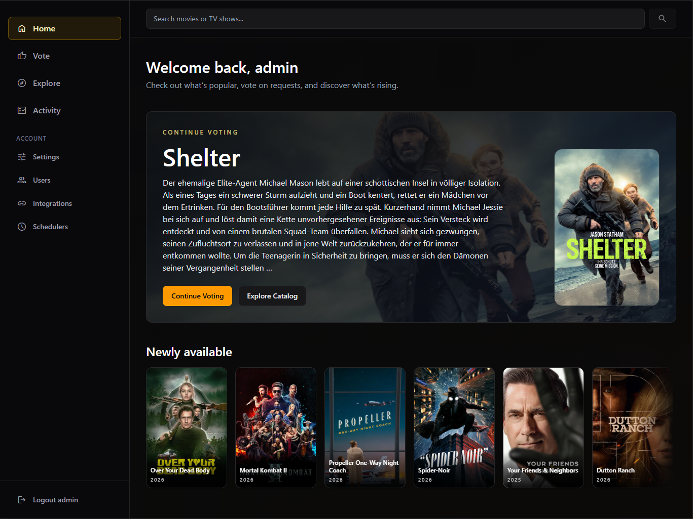
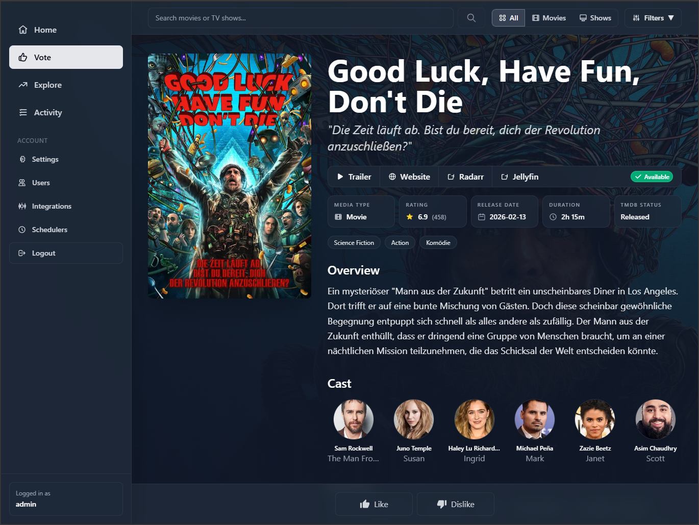
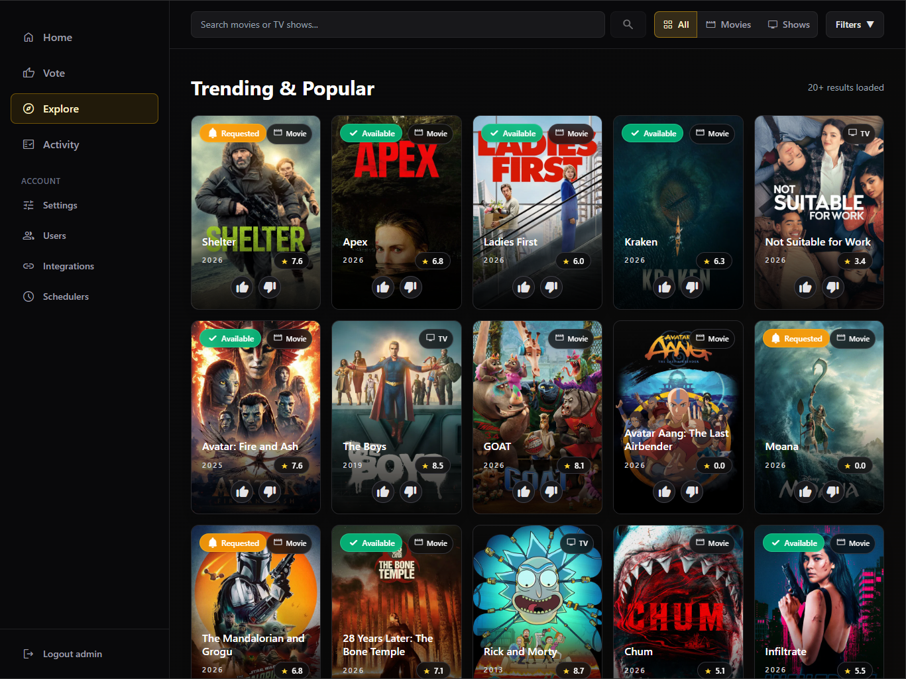

# 🎬 Findarr


> Stop searching. Start finding.

Find movies and shows you actually want — without endless scrolling.

---

<div align="center">
	
	<br />
	
	<br />
	
</div>

---

## ✨ What makes Findarr different

Finding something to watch shouldn’t feel like scrolling the same lists every day.

Findarr is built on a simple idea:

- If you’ve already rated something, you won’t see it again
- No re-evaluating the same titles over and over
- Your feed always stays fresh

You go through content once — like it or dislike it — then move on.

No repetition. No clutter. No déjà vu lists.

---

## ⚡ How it works

> Discover → Like / Dislike → New content only

Everything you've already rated disappears from your discovery flow.

Configure a voting pool (for example, the top 100 movies and shows) and go through it once.

After that, you'll usually only have a handful of new titles to rate every few days.

- No endless lists.
- No maintaining dozens of watchlists.
- No endlessly tweaking filters.

Just a small, constantly refreshed set of movies and shows that adapts to your taste.

---

## 🧠 Smart recommendations

Findarr combines:

- Trending and recent releases
- Your likes and dislikes
- Genre preferences
- Keywords from the movies and shows you've rated

Each user builds their own taste profile and receives personalized recommendations.

That means everyone can share the same media stack while discovering different movies and shows.

Every movie or show you **like** is automatically sent to Radarr or Sonarr.

No separate request buttons. Just like it and move on.

---

## 🧩 Integrations

- [TMDB API](https://www.themoviedb.org/)
- [Radarr](https://radarr.video/) / [Sonarr](https://sonarr.tv/)
- [Jellyfin](https://jellyfin.org/)
- [Docker](https://www.docker.com/)

---

## 🚀 Quick start

Create or copy the [`docker-compose.yml`](/docker-compose.yml) file:

```yaml
services:
  findarr:
    image: ghcr.io/lillifee/findarr:latest
    restart: unless-stopped
    ports:
      - 8585:8585
    volumes:
      - ./data:/app/apps/api/data
```

Run:

```bash
docker compose up -d
```

Open:

```txt
http://localhost:8585
```

---

## 🔐 Setup

1. Create admin account
2. Add TMDB token
3. Start discovering

---

## Metadata

This product uses the TMDB API but is not endorsed or certified by TMDB.
https://www.themoviedb.org/

Plex® is a trademark of Plex Inc. This project is not affiliated with or endorsed by Plex Inc.

---

## ❤️ Built for self-hosters

Hope you find something great to watch.

> Stop searching. Start finding.
